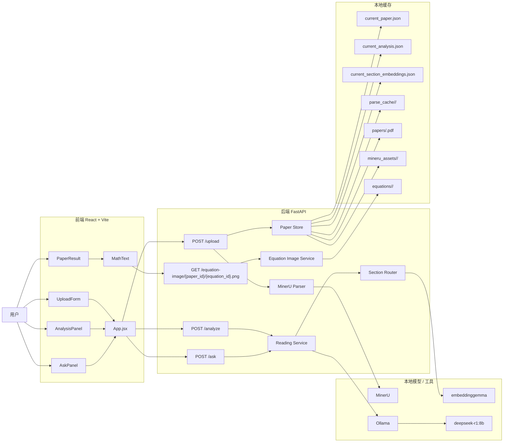
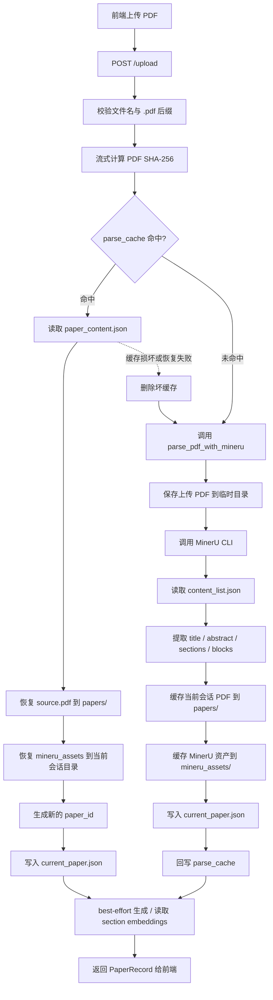
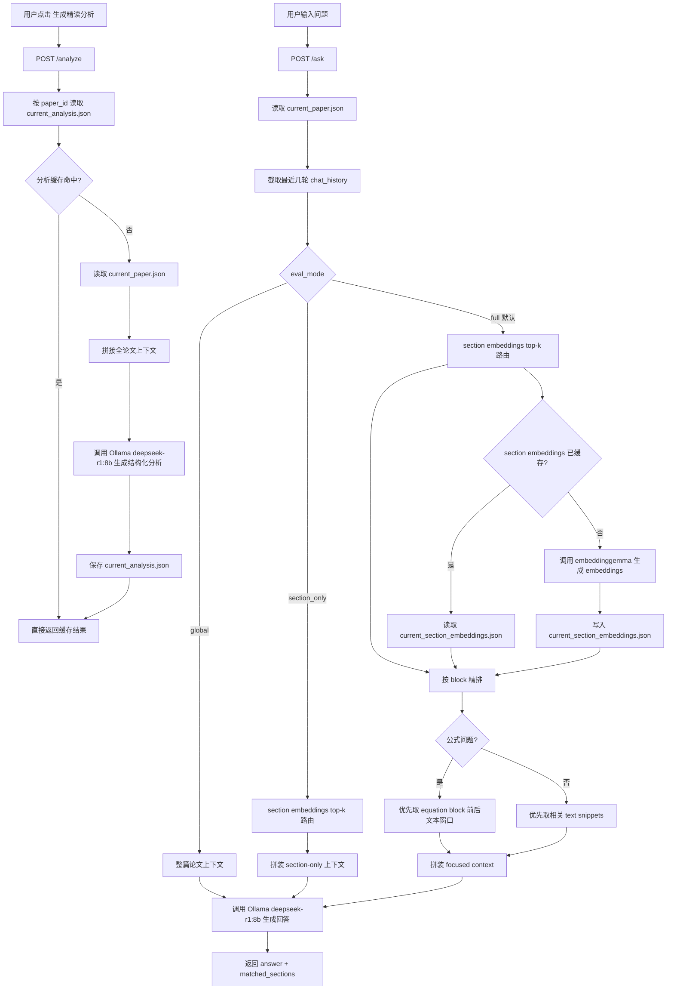
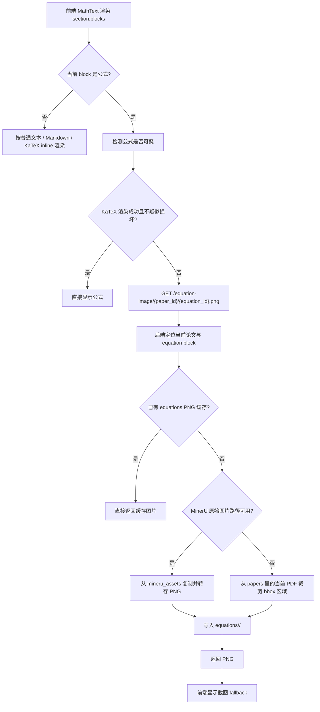

# 单篇论文精读助手流程图

下面的流程图基于当前项目代码整理，采用 Mermaid 语法，适合直接放在 GitHub 或支持 Mermaid 的 Markdown 查看器中阅读。

## 1. 项目总体流程

## 2. 上传、解析与缓存流程

## 3. 精读分析与问答流程

## 4. 公式渲染与图片 fallback 流程

## 5. 代码对应位置

- 上传与解析缓存：`backend/app/api/routes/upload.py`、`backend/app/services/mineru_parser.py`、`backend/app/services/paper_store.py`
- 精读分析与问答：`backend/app/services/reading_service.py`、`backend/app/services/section_router.py`
- 公式截图 fallback：`frontend/src/components/MathText.jsx`、`backend/app/services/equation_image_service.py`
- 前端页面入口：`frontend/src/App.jsx`
